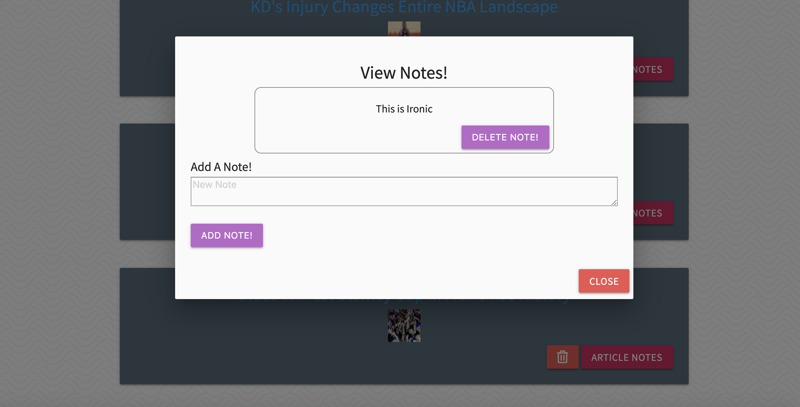

# Sports Article Scraper

This scraper app works by scraping articles from BleacherReport.com, and displaying them on the webpage. A user has the ability to view the articles from their source, or the user can favorite them. On the favorites page a user can add/delete notes, and delete favorites. 

## Getting Started

* Interested in seeing this app deployed? Check it out here!: https://obscure-shore-21174.herokuapp.com/
* If you want to deploy and it host it yourself, checkout the deployment section!

### Installing, and deployment

* Clone or download this code to your local machine

* Open locally in your terminal in the root file, and run npm install

* Run locally with npm start

* If you wish to host this site locally, host with Heroku or netlify. 

## Built With

* Javascript, J-Query, CSS, Cheerio.JS,  Express, Node, MongoDB, mongoose, AJAX calls, handlebars, and MVC design pattern 

## Preview

## Authors

* **Christian Mader** 
